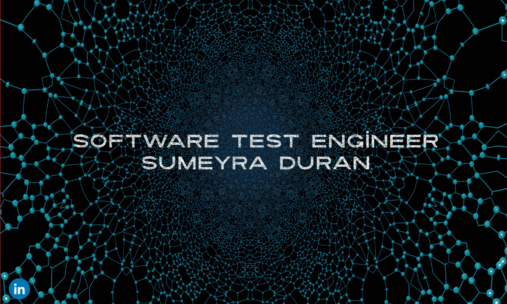

<h1 align="center">Hi 👋, I'm Sumeyra DURAN</h1>           
   

  
  

- 🌱 I’m currently learning **Appium**  

- 💬 Ask me about **Core Java , Selenium , Cucumber , HTML , CSS , SQL**      

- ⚡ Fun fact **I enjoy sketching and painting.**   
 
 

### Languages and Tools:

[][github]
[][github]
[][github]
[][github]
[][github]
[][github]
[][github]
[][github]
[][github]
[][github]
[][github]
[][github]
[][github]

 

 
   
 
 
  

  

### Connect with me:

[][gmail]
[][medium]
[][linkedin]
[][github]

       

[twitter]: https://twitter.com/h_huseyinbulat
[gmail]: mailto:smyrduran3535@gmail.com
[medium]: https://medium.com/@smyrduran3535/
[linkedin]: https://www.linkedin.com/in/sumeyra-duran/
[github]:  https://github.com/smyrduran3535
 # aurafarming
import cv2
import numpy as np
from PIL import Image, ImageEnhance, ImageFilter
import time
import sys
import os

VIDEO_PATH = "1751520327557.mp4"
WIDTH = 48
HEIGHT = 42
FPS = 10
MAX_DURATION = 12

ASCII_CHARS = " `'.,-~:;+=*!#%@█"  

def auto_contrast(img):
    hist = img.histogram()
    min_gray = next(i for i, v in enumerate(hist) if v > 0)
    max_gray = next(i for i in reversed(range(256)) if hist[i > 0])
    scale = 255 / (max_gray - min_gray + 1e-5)
    lut = [max(0, min(255, int((i - min_gray) * scale))) for i in range(256)]
    return img.point(lut)

def frame_to_ascii(frame):
    img = Image.fromarray(frame).convert("L")
    img = auto_contrast(img)
    img = ImageEnhance.Contrast(img).enhance(2.6)
    img = ImageEnhance.Brightness(img).enhance(1.15)
    edge = img.filter(ImageFilter.FIND_EDGES)
    sharp = img.filter(ImageFilter.SHARPEN)
    img = Image.blend(sharp, edge, 0.5)

    img = img.resize((WIDTH, HEIGHT))
    pixels = np.array(img)

    ascii_img = []
    for row in pixels:
        line = ''.join(
            ASCII_CHARS[int(p / 256 * len(ASCII_CHARS))] * 2 for p in row
        )
        ascii_img.append(" " + line)  
    return '\n'.join(ascii_img)

cap = cv2.VideoCapture(VIDEO_PATH)
video_fps = cap.get(cv2.CAP_PROP_FPS) or 25
interval = max(1, int(video_fps // FPS))
total_frames = int(cap.get(cv2.CAP_PROP_FRAME_COUNT))

max_frames = total_frames
if MAX_DURATION:
    max_frames = min(total_frames, int(FPS * MAX_DURATION))

ascii_frames = []
count = 0
while cap.isOpened() and len(ascii_frames) < max_frames:
    ret, frame = cap.read()
    if not ret:
        break
    if count % interval == 0:
        ascii_frames.append(frame_to_ascii(frame))
    count += 1
cap.release()

os.system('cls' if os.name == 'nt' else 'clear')
delay = 1 / FPS

try:
    while True:
        for f in ascii_frames:
            sys.stdout.write("\033c")
            sys.stdout.write(f + "\n")
            sys.stdout.flush()
            time.sleep(delay)
except KeyboardInterrupt:
    print("\n\033[1;32m✅ Selesai.\033[0m")

line = ''.join(
    ASCII_CHARS[int(p / 256 * len(ASCII_CHARS))] for p in row
)

